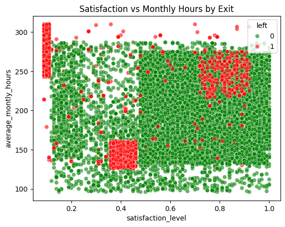

# 🧠 Employee Exit Prediction using Machine Learning

This project explores why experienced employees leave an organization, using machine learning techniques to help HR departments better understand attrition patterns and potentially prevent premature exits.

---

## 📂 Project Structure

- `HR.ipynb` – Full analysis and model building notebook
- `HR_comma_sep.csv` – Original HR dataset (≈15,000 entries)
- Visualizations (PNG files) to help understand feature interactions and model performance

---

## 🎯 Objectives

- Explore how satisfaction and work hours influence employee exit
- Analyze the effect of salary, promotion, department on attrition
- Build multiple models:
  - Logistic Regression
  - Decision Tree
  - Support Vector Machine (SVM)
  - Artificial Neural Network (ANN)
- Compare their performance and interpret key insights

---

## 🔧 Installation

```bash
git clone https://github.com/ShashankGoutam/Employee_Exit_Prediction.git
```
Open the notebook in VSCode / JupyterLab to launch and edit HR.ipynb

> Note: You will need Python 3.7+ and the following libraries:
> `pandas`, `numpy`, `seaborn`, `matplotlib`, `scikit-learn`, `tensorflow`

---

## 📊 Visual Insights

### 1. Class Distribution


### 2. Satisfaction vs Work Hours


### 3. Correlation Heatmap


### 4. ANN Accuracy Over Epochs


---

## 🧪 Model Results

| Model              | Accuracy | Notes                            |
|-------------------|----------|----------------------------------|
| Logistic Regression | ~76%     | Good baseline                    |
| Decision Tree       | ~98%     | Risk of overfitting              |
| SVM (RBF Kernel)    | ~94%     | Performs well with scaling       |
| ANN (2 hidden layers) | ~76%  | Matches logistic baseline        |

---


## 📌 Acknowledgments

This project is based on a capstone scenario involving HR analytics for employee attrition.

---

